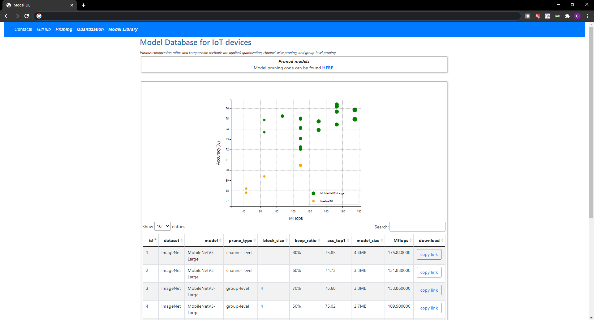

# ANT Model DB
This project includes model database, model profilers, and model dashboard used in ANT framework.

The model database provides DNN models for various range of IoT devices.

## Model/Kernel Database
Model database records compressed DNN models.

Kernel database tunes kernel codes of those compressed models and collects them.

* Usage
```bash
python modeldb_sender.py --table <model_db_table_name> --path <directory_to_record> [--save_as_csv]
```


## Model Profiler
Model profiler can measure latency using programs in latency-predictor, which implemented based on TVM.

### References
This project is implemented based on TVM

* TVM  [https://github.com/apache/incubator-tvm][tvm]


### Prerequisites

* llvm [Download Page][llvm]
* CUDNN [Download Page][CUDNN]
* CUDA

## Model Dashboard
Model dashboard is a web page that shows available compressed model in model database and kernel code in kernel database.
This dashboard web server is implemented based on Flask.

* Usage

```bash
python dashboard-run.py 
```



# License
ANT-Model-DB is open source software under the Apache 2.0 license. 

[tvm]:https://github.com/apache/incubator-tvm
[llvm]:http://releases.llvm.org/download.html
[CUDNN]:https://developer.nvidia.com/cudnn
